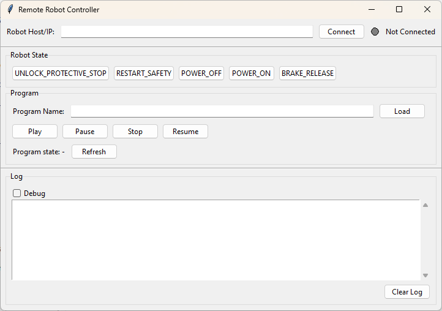
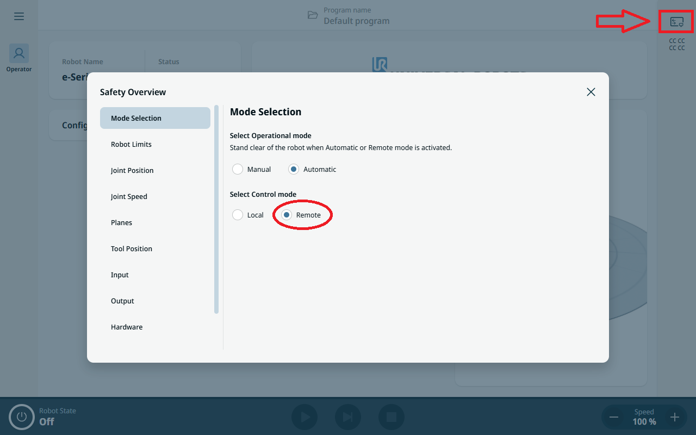

## Remote Robot Controller

Desktop GUI to control a Polyscope X Universal Robots robot via the Robot API. The app provides quick access to robot state actions, program loading and execution, and live status feedback over HTTP. This currently only functions with a real robot and does NOT work with URSim.



### Features
- **Robot State controls**: `UNLOCK_PROTECTIVE_STOP`, `RESTART_SAFETY`, `POWER_OFF`, `POWER_ON`, `BRAKE_RELEASE`
- **Program management**: Load by name, and control program state (`play`, `pause`, `stop`, `resume`). Note: provide the program name only (do not include the `.urpx` extension) or the command will fail.
- **Connection status**: Visual indicator and log panel with optional debug details
- **No external deps**: Pure Python stdlib (Tkinter + urllib)

### Requirements
- Python 3.11+
- A Universal Robots controller running Polyscope X
- Robot in **Remote Control** mode for most commands
- Network connectivity to the controller

#### Enabling Remote Control Mode
To use this application, you must first enable **Remote Control** mode on your UR robot. In Polyscope X, navigate to the Safety Overview and select **Remote** as the Control mode (you must already be in Automatic mode to enable it):



**Note:** Most robot state and program control commands will only work when the robot is in Remote Control mode.


### Running the App
You can run as a script or as a module. After cloning the repo you can run the following in a terminal:

```bash
# From repo root (inside remote_robot_controller/)
python app.py
```

Module form must be run from the directory that contains the `remote_robot_controller/` folder (i.e., the parent of the repo folder):

```bash
# From the parent directory that contains remote_robot_controller/
python -m remote_robot_controller.app
```

Enter the robot controller host/IP (e.g., `10.0.0.5` or `http://10.0.0.5`) and click **Connect**. Use the provided buttons to send actions and manage programs. The log panel shows concise messages; enable **Debug** for full HTTP details (status, URL, headers, body) when troubleshooting.

### REST Endpoints
All endpoints are served under the base URL:

```
http://{host}/universal-robots/robot-api
```

#### Robot State Domain
Provides control over the robot's operational state.

```
PUT /robotstate/v1/state
Request: { "action": "UNLOCK_PROTECTIVE_STOP" }
Supported actions:
  UNLOCK_PROTECTIVE_STOP | RESTART_SAFETY | POWER_OFF | POWER_ON | BRAKE_RELEASE

Responses:
  200 OK – State changed successfully
  409 Conflict – Invalid state transition (e.g., not in PROTECTIVE_STOP)
  500 Internal Server Error
  504 Gateway Timeout
  422 Validation Error
```

#### Program Domain
Provides control over robot programs.

```
PUT /program/v1/load
Request: { "programName": "example" }
Responses:
  200 OK | 500 Internal Server Error | 422 Validation Error

PUT /program/v1/state
Request: { "action": "play" }
Supported actions: play | pause | stop | resume
Responses:
  200 OK | 500 Internal Server Error | 422 Validation Error

GET /program/v1/state
Responses:
  200 OK | 500 Internal Server Error
```

#### Developer Notes
- Error handling uses standardized schemas: `APIError`, `APIResponse`, `HTTPValidationError`.
- Use `RobotStateResponse` and `LoadProgramRequest` schemas for structured communication.


### Troubleshooting
- Verify the controller is reachable (ping the host/IP) and in Remote Control mode.
- If HTTPS redirection is used (307/308), the client will follow up to 3 redirects.
- Use the **Debug** checkbox to see detailed HTTP errors and response bodies.
- Ensure program names match exactly when loading via `PUT /program/v1/load`.


